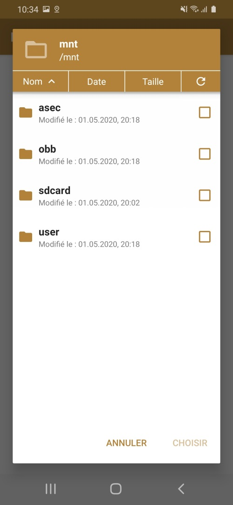
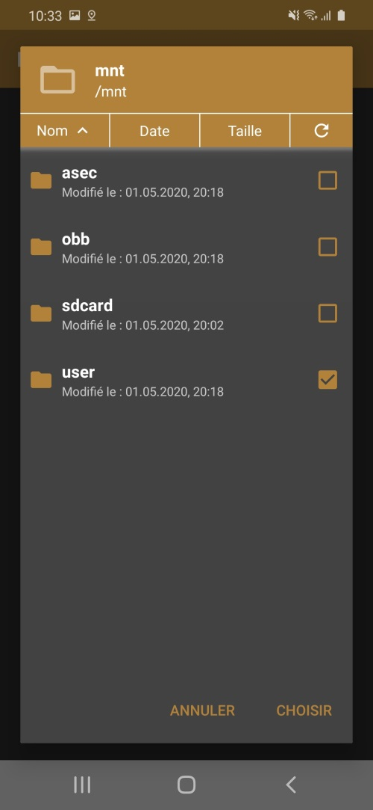
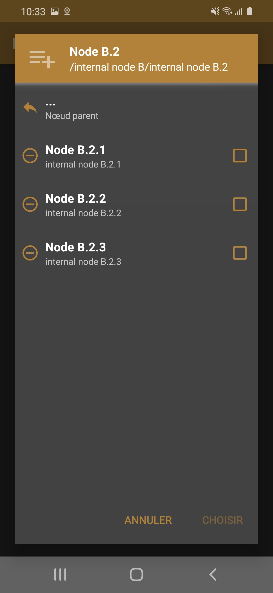

# Picker
Android Library to create picker dialogs.

### Developed by
[Nicolas Dagnas](https://www.github.com/ndagnas) ([@NDagnas](https://www.twitter.com/NDagnas))

### Inspired by
[Angad Singh - filepicker](https://www.github.com/angads25/android-filepicker) and [Aefyr - filepicker](https://www.github.com/Aefyr/android-filepicker)

### Where to Find
[](https://android-arsenal.com/api?level=23)

### Picker Dialog Base Features
* Easy to Implement.
* No permissions required.
* Dark theme supported.

### File Picker Features
* Easy to use.
* Files, Directory Selection.
* Single or Multiple File selection.
* Column sort.
* RegEx filters

### Json Picker Features
* Select by node.

### Builder Design Patterns
* All dialogs support

### Installation
* Library is also Available in JCenter, So just put this in your app dependencies to use it:
```gradle
    repositories {
		...
        jcenter()
		...
    }
```

```gradle
    compile 'com.github.ndagnas:pickers:0.2.5'
```

### Autorisation (Android 10 or more)
Update `AndroidManifest.xml` like this:

```xml
	<application
		...
		android:requestLegacyExternalStorage="true"
		...
		>
```

### Usage
Use same of AlertDialog.

```java
	new FilePickerDialog.Builder (this)
			.setRequestCode(EXTERNAL_READ_PERMISSION_GRANT)
			.setTitle("Select a File")
			.setOffsetDir(FilePickerDialog.DEFAULT_DIR)
			.setRootDir(FilePickerDialog.DEFAULT_DIR)
			.setErrorDir(FilePickerDialog.DEFAULT_DIR)
			.setSelectionType(FilePickerDialog.FILE_SELECT)
			.setOnSingleChoiceValidationListener(
				new PickerInterface.OnSingleChoiceValidationListener<String>() {
					@Override
					public void onClick ( PickerInterface sender, String result ) {
						//file is the path of file selected by the Application User.
					}
				})
			.show();
```

### NOTE:
Marshmallow and above requests for the permission on runtime. You should override `onRequestPermissionsResult` in Activity/AppCompatActivity class and show the dialog only if permissions have been granted.

```java
        //Add this method to show Dialog when the required permission has been granted to the app.
        @Override
        public void onRequestPermissionsResult(int requestCode,@NonNull String permissions[],@NonNull int[] grantResults) {
            switch (requestCode) {
                case EXTERNAL_READ_PERMISSION_GRANT: {
                    if (grantResults.length > 0 && grantResults[0] == PackageManager.PERMISSION_GRANTED) {
                        if(dialog!=null)
                        {   //Show dialog if the read permission has been granted.
                            dialog.show();
                        }
                    }
                    else {
                        //Permission has not been granted. Notify the user.
                        Toast.makeText(MainActivity.this,"Permission is Required for getting list of files",Toast.LENGTH_SHORT).show();
                    }
                }
            }
        }
```

### Important:
* `rootDir`, `errorDir`, `offsetDir` must have valid directory/file paths.
* `patterns` must are regexes.

### Screenshot
<p align="center">
 </br>
 
 &nbsp;
 
 &nbsp;
 
</p>

### License
    Copyright (C) 2020 Nicolas Dagnas

    Licensed under the Apache License, Version 2.0 (the "License");
    you may not use this file except in compliance with the License.
    You may obtain a copy of the License at

       http://www.apache.org/licenses/LICENSE-2.0

    Unless required by applicable law or agreed to in writing, software
    distributed under the License is distributed on an "AS IS" BASIS,
    WITHOUT WARRANTIES OR CONDITIONS OF ANY KIND, either express or implied.
    See the License for the specific language governing permissions and
    limitations under the License.